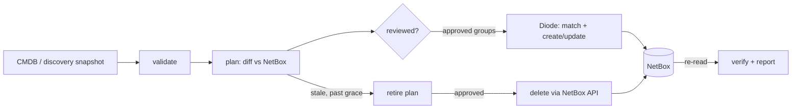

# netbox-diode: inventory reconciliation MVP

Keep NetBox, the network source of truth, in line with what the CMDB says and what the network
actually contains. Changes are applied through **NetBox Labs Diode**. Each run is planned before it
writes, can be reviewed, is checked against NetBox afterwards, and is reported. Nothing is deleted
without an approved retirement plan.

## What it shows

One command builds a complete stack: NetBox 4.7.2, the Diode plugin 1.18.0, and Diode server 2.3.1
with OAuth2. A second command runs a 5-phase lifecycle on 50 devices, 233 interfaces, 54 IPs,
11 VLANs, 14 prefixes and 69 cables across 3 sites.

| Phase | What happens | Result (from [`reports/summary.md`](reports/summary.md)) |
|---|---|---|
| 1. Baseline | CMDB export loaded into an empty NetBox | 431 objects created, every one checked |
| 2. Re-run | Same export again | **0 NetBox writes**: idempotent |
| 3. Discovery, reviewed | Drift: new, changed and missing devices, VLANs, prefixes, cables. Reviewer **rejects** an unauthorised switch; a re-patched uplink is **BLOCKED** | 27 created, 9 updated, 11 flagged stale, 34/34 checks |
| 4. Retire | Approved retirement plan: stale devices, cables, IPs, VLAN, prefix | 14/14 deleted, each re-checked first |
| 5. Converge | Re-plan; the rejection carries over | re-patched uplink now created; NetBox matches the reviewed state |

Every phase fails if an approved item does not land in NetBox, or if anything else drifts. Latest
clean run: **5/5 PASS**, demo about 2 min. A fresh stack takes about 5 min to start (NetBox runs its
database migrations on first boot).

## Quick start

Requirements: Docker 27+ with Compose v2, Python 3.12+ (only for `make init`), and about 4 GB RAM.

```bash
make up      # generate secrets, build, start, wait until healthy
make demo    # 5-phase scenario -> reports/summary.md, detail/*.csv, review-*.json, retire-plan.json
```

NetBox UI: http://localhost:8000. The user is `admin`; the password is `NETBOX_SUPERUSER_PASSWORD` in
`.env`. Diode's changes appear under the `diode` user in the changelog, with tags `src-cmdb` and
`src-discovery`, and in the device custom fields *Reconciliation state* and *Stale since*.

## Day-to-day use

```bash
make plan SNAPSHOT=data/discovery_day1.json                    # dry run + reports/review.json
#   edit reports/review.json: "decision": "reject" (+ "note") on any group
make recon ARGS="apply /app/data/discovery_day1.json --plan /app/reports/review.json"
make recon ARGS="retire plan /app/data/discovery_day1.json --out /app/reports/retire.json"
#   review reports/retire.json (grace period: RECON_RETIRE_GRACE_DAYS, default 30)
make recon ARGS="retire apply /app/reports/retire.json --approve"
```

| Safeguard | Behaviour |
|---|---|
| Review file | One item per group (a device with its interfaces and IPs, or one VLAN, prefix or cable); approve or reject each |
| Up-to-date check | `apply --plan` refuses (exit 3) if NetBox or the snapshot changed since review |
| Carried decisions | `plan --decisions old.json` keeps earlier rejections for identical groups |
| Blast-radius guard | Unreviewed applies refuse when updates + stale exceed 20% of existing objects (`--force` overrides) |
| Retirement | Grace period, `--approve` required, every item re-checked (same id, unchanged, still stale) |

Other targets: `make test` (ruff, mypy strict, pytest with ≥85% coverage gate), `make bench`
(scale benchmark), `make status`, `make logs`, `make reset`.

## How it works



Diode is the write path for creates and updates. It handles matching, dependency ordering and
idempotency, so every write is authenticated and audited. The `inventory-recon` tool adds what OSS
Diode does not provide:

- input validation
- planning and review before anything is written
- a stale marker that clears itself when an object reappears
- retirement, because Diode cannot delete
- independent verification and reports

Docs:
- [Architecture and process](docs/architecture.md)
- [MVP limitations: plan, design and status](docs/limitations-plan.md)
- [Rancher (RKE2 + Helm) plan](docs/rancher.md)
- [Scale benchmark](reports/scale.md)

## Repository

```
docker-compose.yaml        whole stack, pinned images (base images by digest), health-gated
netbox/                    NetBox image with the Diode plugin baked in
diode/                     Diode ingress + database init
src/inventory_recon/       reconciliation tool: models, diff, review, reconcile, retire, report
data/                      mock snapshots (generated by scripts/generate_mock_data.py)
reports/                   output of the last demo run (committed as evidence)
tests/                     unit tests incl. full lifecycle against a Diode simulator
.github/workflows/ci.yml   quality gates, then a full compose + demo run on every push
```

## Security notes

- `make init` creates unique secrets and three least-privilege OAuth2 clients per install. `.env` and
  `secrets/` are git-ignored.
- Creates and updates go through Diode under the `diode` user. The only direct NetBox write is an
  approved deletion, which can use its own token (`RECON_NETBOX_WRITE_TOKEN`).
- Only NetBox (`:8000`) and the Diode gRPC port (`:8080`) are published. For production, put both
  behind TLS (see the Rancher doc).

## Versions

NetBox 4.7.2 (netbox-docker 5.1.1) · Diode server 2.3.1 · Diode NetBox plugin 1.18.0 ·
Diode Python SDK 1.14.2 · ORY Hydra 26.2.0 · PostgreSQL 16.15 · Redis 7.4.11 · nginx 1.30.5 ·
inventory-recon 0.2.0
