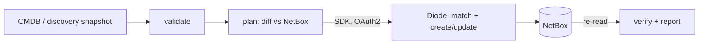

# netbox-diode: inventory reconciliation MVP

Keep NetBox, the network source of truth, in line with what the CMDB says and what the network
actually contains. Changes are applied automatically through **NetBox Labs Diode**. Every run is
planned before it writes, checked against NetBox afterwards, and reported.

## What it shows

One command builds a complete stack: NetBox 4.7.2, the Diode plugin 1.18.0, and Diode server 2.3.1
with OAuth2. A second command runs a 3-phase scenario on 50 devices across 3 sites and writes
reports.

| Phase | What happens | Result (from [`reports/summary.md`](reports/summary.md)) |
|---|---|---|
| 1. Baseline | CMDB export loaded into an empty NetBox | 245 objects created, every one verified |
| 2. Re-run | Same export sent again | **0 NetBox writes**: idempotent, no duplicates |
| 3. Discovery | Discovery finds drift | 3 new devices, 7 changed (RMA serials, OS upgrades, go-lives), 5 new IPs, 8 new interfaces, 3 missing devices flagged (not deleted) |

Each phase fails if any planned item fails to land in NetBox, or if NetBox drifts anywhere the plan
did not expect. Two runs in a row from a clean slate: **3/3 PASS** both times. The demo takes about
50 s. A fresh stack takes about 5 min to start (NetBox runs its database migrations on first boot);
after that, start-up takes about 1 min.

## Quick start

Requirements: Docker 27+ with Compose v2, Python 3.12+ (only for `make init`), and about 4 GB RAM.

```bash
make up      # generate secrets, build, start, wait until healthy
make demo    # run the scenario; writes reports/summary.md, reports/detail/*.csv, reports/run.json
```

NetBox UI: http://localhost:8000. The user is `admin`; the password is `NETBOX_SUPERUSER_PASSWORD` in
`.env`. Diode's changes appear under the `diode` user in the changelog, and in the tags `src-cmdb`,
`src-discovery` and `recon-stale`.

| Command | Purpose |
|---|---|
| `make plan SNAPSHOT=data/discovery_day1.json` | Dry run: show the drift and write nothing |
| `make reset` | Delete all data for a fresh NetBox (run `make up demo` again afterwards) |
| `make status` / `make logs` | Health of each container / follow the Diode logs |
| `make test` | tox: ruff lint + format, mypy (strict), pytest (≥85% coverage gate) |

Behind a TLS-inspecting proxy, set `EXTRA_CA_BUNDLE=/path/ca.pem` in `.env`. It is used only for
image builds.

## How it works



Diode is the only path that writes to NetBox. It handles matching, dependency ordering and
create/update, so every write is authenticated and audited. The `inventory-recon` tool adds what OSS
Diode does not provide:

- input validation: schema, duplicate names, serials and IPs
- a plan made before anything is written
- stale-asset detection, where stale devices are flagged `offline` + `recon-stale` and never deleted
- verification with one self-healing retry
- reports

Full design, diagrams, decision rules and limitations: [docs/architecture.md](docs/architecture.md).
Plan for moving to Rancher (RKE2 + Helm): [docs/rancher.md](docs/rancher.md).

## Repository

```
docker-compose.yaml        whole stack, pinned images, health-gated
netbox/                    NetBox image with the Diode plugin baked in
diode/                     Diode ingress + database init
src/inventory_recon/       reconciliation tool (pydantic, httpx, Diode SDK)
data/                      mock snapshots (generated by scripts/generate_mock_data.py)
reports/                   output of the last demo run (committed as evidence)
tests/                     29 unit tests, incl. the demo's expected drift and failure/retry paths
.github/workflows/ci.yml   quality gates, then a full compose + demo run on every push
```

## Security notes

- `make init` creates unique secrets and three least-privilege OAuth2 clients per install. `.env` and
  `secrets/` are git-ignored.
- The tool only reads from NetBox, with a token supplied through the environment. Writes go through
  Diode under the `diode` user.
- Only NetBox (`:8000`) and the Diode gRPC port (`:8080`) are published. For production, put both
  behind TLS (see the Rancher doc).

## Versions

NetBox 4.7.2 (netbox-docker 5.1.1) · Diode server 2.3.1 · Diode NetBox plugin 1.18.0 ·
Diode Python SDK 1.14.2 · ORY Hydra 26.2.0 · PostgreSQL 16.15 · Redis 7.4.11 · nginx 1.30.5
