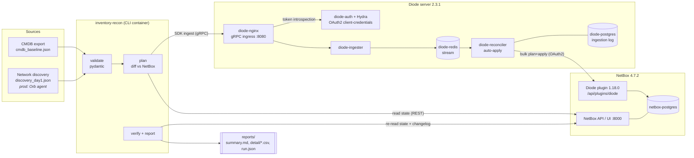
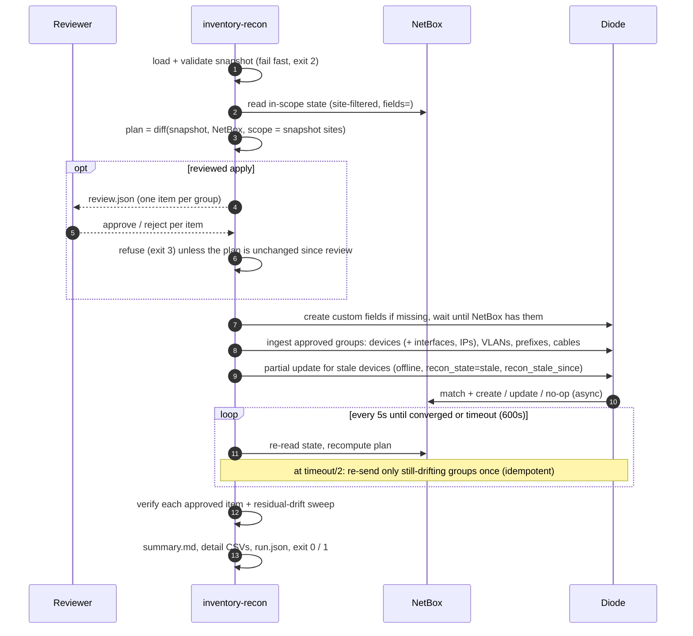
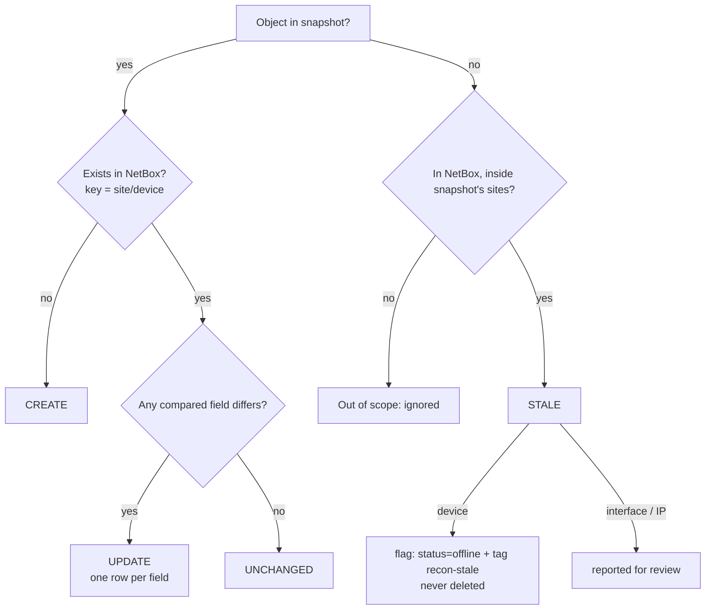

# Architecture and process

## 1. Problem and approach

Inventory data comes from several places that do not agree: the CMDB says what *should* exist,
network discovery says what *does* exist. NetBox is the source of truth, so it has to be reconciled
against both without corrupting it.

**Diode** (NetBox Labs, open source) is the write path. Producers send *what they observed*.
Diode matches each object against NetBox and decides whether to create it, update it or leave it
alone. The producer never has to work out NetBox IDs or ordering, and sending the same data twice is
safe. OSS Diode only creates and updates, though; it never deletes and never reports what is
*missing*. The **inventory-recon** tool in this repo fills that gap and makes every run auditable:

| Concern | Who handles it |
|---|---|
| Authenticated ingestion, matching, create/update, dependency ordering | Diode (ingester + reconciler + NetBox plugin) |
| Input validation (schema, duplicate serials/IPs/names) | inventory-recon (pydantic) |
| Plan before write: create / update / unchanged / stale | inventory-recon (`diff.py`) |
| Stale assets (in NetBox, absent from the source) | inventory-recon flags them through Diode: `status=offline` + custom fields `recon_state=stale`, `recon_stale_since` |
| Review before apply | inventory-recon: editable review file, approve/reject per group, refused if out of date |
| Deletion (Diode cannot delete) | inventory-recon `retire`: approved plan, grace period, every item re-checked, NetBox REST API |
| Proof the write landed: wait for convergence, verify each item, sweep for residual drift | inventory-recon (`reconcile.py`) |
| Audit: summary + detail reports, NetBox changelog write count | inventory-recon (`report.py`) + NetBox changelog (user `diode`) |

## 2. Components

Only NetBox (`:8000`) and the Diode gRPC ingress (`:8080`) are published. Everything else stays
on the internal compose network. Three OAuth2 clients, each with its own scope, are generated per
install (`make init`):

| Client | Scope | Used by |
|---|---|---|
| `diode-ingest` | `diode:ingest` | inventory-recon, Orb agents, any SDK producer |
| `diode-to-netbox` | `netbox:read netbox:write` | Diode reconciler calling the NetBox plugin |
| `netbox-to-diode` | `diode:read diode:write` | NetBox plugin calling Diode |

## 3. Reconciliation process (one phase)

Retirement (deletes) is a separate, explicitly approved flow: see
[limitations-plan.md §3](limitations-plan.md#3-retirement-the-only-delete-path-done).

## 4. Decision rules

| Object | Identity | Compared fields |
|---|---|---|
| Device | site + name | role, manufacturer, model, platform, serial, status |
| Interface | site + device + name | type, enabled |
| IP address | address (with prefix length) | assigned interface |
| VLAN | site + VID | name, status |
| Prefix | prefix | site, VLAN, status |
| Cable | unordered pair of interfaces | status |

Scope rule: a source can mark objects stale only in the sites it reports on, so a branch-only
discovery job can never flag data-center inventory.

## 5. Demo scenario (ground truth)

`scripts/generate_mock_data.py` builds 50 devices across 3 sites (2 data centers, 1 branch; Juniper,
Arista, Palo Alto, Opengear, Cisco, Fortinet), 233 interfaces, 54 IPs, 11 VLANs, 14 prefixes and
69 cables (spine-leaf fabric, core and firewall links, branch star). It always produces the same
output. The day-1 discovery file has exactly this drift, and `tests/test_diff.py` fails if the
expected counts ever change:

| Drift | Devices | Expected outcome |
|---|---|---|
| Unknown device on the network | dal1-leaf-13, nyc1-acc-07, atl1-lab-sw01 | created, with interfaces + mgmt IP |
| Hardware RMA (serial changed) | dal1-leaf-04, nyc1-acc-03 | serial updated |
| OS upgrade | dal1-spine-01/02, atl1-spine-01 | platform eos-4.31 → eos-4.33 |
| Went live | atl1-leaf-11/12 | status planned → active |
| Mgmt re-addressed | nyc1-wlc-01, atl1-fw-02 | new IP created; old IP reported stale |
| Line card added | dal1-core-01 | interface et-0/0/2 created |
| Not seen by discovery | dal1-oob-02, atl1-leaf-07, nyc1-acc-06 | flagged stale, then retired on approval |
| Unauthorised device | atl1-lab-sw01 | **rejected by the reviewer**; rejection carries over to later plans |
| Uplink re-patched | dal1-leaf-02 Ethernet49/1 → spine-01 Ethernet14/1 | **BLOCKED**, old cable retired, then created |
| VLAN / prefix changes | IoT VLAN added, storage VLAN renamed, legacy VLAN + prefix removed, 3 prefixes added, 1 status change | created / updated; removed ones retired |

## 6. Reliability measures

- **Idempotent by construction.** Every run sends the full snapshot and Diode decides what to write.
  Phase 2 of the demo proves it with *0 NetBox changelog writes*.
- **Verification is independent of Diode.** Success means NetBox actually holds the expected
  state, re-read through the REST API. Diode accepting the request is not enough.
- **Bounded waiting with one self-heal.** Diode applies changes asynchronously. The tool polls until
  NetBox converges. Halfway through the timeout it re-sends only the objects that still drift, once.
- **Fail closed.** An invalid snapshot is rejected before any write. Diode errors, missing items or
  unexpected drift fail the phase (exit 1) and are listed in the report.
- **Writes go through Diode.** Creates and updates are authenticated, logged under the `diode` user
  and visible in NetBox's changelog. The only direct NetBox write is an approved retirement (delete).
- **Guarded.** Unreviewed applies refuse large changes to existing inventory (blast-radius guard);
  reviewed applies refuse if NetBox or the snapshot changed since review.
- **Pinned versions** for every image and Python dependency. Health-gated startup (`up --wait`).

## 7. Limitations

The original MVP limitations, the design for each, and what was built: see
[limitations-plan.md](limitations-plan.md). The remaining open item is VM reconciliation, which is
designed but waits for a VM source.
