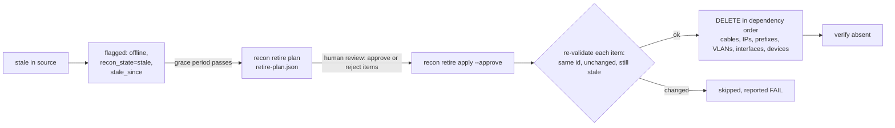

# MVP limitations: plan, design and status

Each MVP limitation was checked against the live stack (Diode 2.3.1, NetBox 4.7.2) before
designing a fix. Four of the five are implemented and pass in the demo and the unit tests.
VMs are designed but not built, because there is no VM source to reconcile against yet.

| # | Limitation | Decision | Status |
|---|---|---|---|
| 1 | Only devices, interfaces and IPs reconciled | Add VLANs, prefixes and cables to schema, diff, ingest and verification. VMs: design only | **Done** (VMs designed) |
| 2 | `recon-stale` tag cannot be removed (Diode merges tags) | Replace the tag with custom fields `recon_state` and `recon_stale_since`, which Diode overwrites | **Done** |
| 3 | Diode cannot delete | `recon retire`: plan, approve, then execute with a grace period and a re-check of each object right before deletion | **Done** |
| 4 | No review-before-apply UI in OSS Diode | Editable review file approved per group, checked to be current before apply; decisions carry over; blast-radius guard | **Done** |
| 5 | Full NetBox reads | Server-side site scoping, `fields=` projection, IP reads chunked by device; benchmark | **Done** |

The demo now shows all of it in 5 phases: baseline, idempotent re-run, reviewed discovery with one
rejection and one blocked cable, approved retirement, and convergence.

## What the live probes established

| Behaviour (Diode 2.3.1 → NetBox 4.7.2) | Consequence for the design |
|---|---|
| Custom-field values are **replaced** on update; tags are **merged** | Reconciliation state lives in custom fields, so it can be cleared |
| Diode can create custom fields itself (`CustomField` entity) | No manual NetBox setup: every apply sends them first (idempotent) |
| VLANs match on site + VID; prefixes on prefix; updates apply in place | Straightforward create/update/stale |
| Cables match on their terminations, in either order; re-sending creates no duplicate | A cable's identity is its unordered pair of interfaces |
| A **re-patched** cable (an interface already holds another cable) is *accepted* by the API, then rejected by NetBox: `Duplicate termination found` | Planned as **BLOCKED** and not sent until the old cable is retired. An apply alone can never re-patch |
| A cable whose ends nest **full** device objects with different platforms fails: `Conflicting values ... merging duplicate dcim.platform` | Cable ends reference devices by site + name only (found by the demo's verification, fixed) |
| Diode acknowledges an ingest before NetBox applies it, so ingest "success" says nothing about the outcome | The read-back verification is required, not optional |
| Diode does **not** order work across requests: devices sent with custom fields before the fields existed failed (`Unknown field name 'recon_state'`), and cables sent before their devices failed (`device_type is required`) | Two waits before sending: custom fields first, then cables once their devices are visible in NetBox. Both were found by live runs (the half-time retry had masked them) and are covered by a regression test that applies requests in reverse order |

## 1. Object coverage: VLANs, prefixes, cables (done); VMs (designed)

**Design.** The snapshot schema gains `vlans`, `prefixes` and `cables`, and validates them: no
duplicate VLANs or prefixes, no interface used by two cables, cable ends must exist in the snapshot,
and a prefix's VLAN must exist at its site. One generic comparison now handles every type
(`diff._compare`).

| Object | Identity | Compared | Stale scope |
|---|---|---|---|
| VLAN | site + VID | name, status | VLANs at the snapshot's sites |
| Prefix | prefix | site, VLAN, status | prefixes scoped to the snapshot's sites |
| Cable | unordered pair of interfaces | status | cables touching the snapshot's sites |

**Mock data:** 11 VLANs, 14 prefixes, 69 cables (spine–leaf fabric, core and firewall links, branch
star). Day-1 drift adds a new IoT VLAN, a renamed storage VLAN, a removed legacy VLAN and prefix, a
prefix brought into service, two new management subnets, cables for the new devices, and one
**re-patched leaf uplink**.

**VMs (designed, not built).** Same pattern, from a hypervisor source (vCenter/Proxmox exporter):
- identity: cluster + VM name
- compared: status, vCPUs, memory, disk, platform, role
- children: VM interfaces + IPs
- stale scope: the source's clusters

That is about 2–3 days including mock data and tests. It is deferred because the MVP has no VM
source, and a reconciler without a real source would only exercise mock data.

## 2. Stale marker that can be cleared (done)

**Design.** Diode creates two device custom fields on every apply (idempotent):
- `recon_state`: `present` or `stale`
- `recon_stale_since`: the snapshot date on which the device was first missing

Stale devices also get `status=offline`. Every device in a snapshot is sent with
`recon_state=present`, so a device that reappears goes back to its source status and is cleared
**automatically**; the report shows `recon_state stale -> present`. Already-flagged devices are not
sent again, so `recon_stale_since` keeps the first date. That date is what the retirement grace
period counts from.

## 3. Retirement: the only delete path (done)



- **Eligible:** flagged devices past `RECON_RETIRE_GRACE_DAYS` (default 30; the demo uses 0), plus
  their cables and IPs. Stale cables, IPs, VLANs and prefixes need no grace period but still need
  approval.
- **Safety:**
  - `--approve` is mandatory; without it the command exits 3.
  - Items can be rejected one by one in the plan file.
  - Each item's NetBox id and a fingerprint of its state are re-checked just before deletion, so an
    out-of-date plan can never delete something that has changed.
  - Deletions use NetBox's REST API, the only operation Diode cannot do. They can run under a
    dedicated token (`RECON_NETBOX_WRITE_TOKEN`) and are recorded in NetBox's changelog.
- **Re-patch:** retiring the old cable unblocks the new one, and the next apply creates it.

## 4. Review before apply (done)

OSS Diode can hold change sets for review (`AUTO_APPLY_CHANGESETS=false`), but the plugin has no UI
to approve them. The review therefore happens **before** sending:

```text
recon plan SNAPSHOT --out review.json [--decisions previous.json]   # editable, one item per group
# reviewer sets "decision": "reject" (+ note) on any item
recon apply SNAPSHOT --plan review.json
```

- **Group** = the unit of approval: a device with its interfaces and IPs, or one VLAN, prefix or
  cable. Rejecting a device also rejects cables to it; otherwise the cable would create the device.
- **Up-to-date check:** apply recomputes the plan and refuses (exit 3) if the snapshot hash or any
  group's fingerprint differs from what was reviewed.
- **Carried decisions:** `--decisions` copies earlier decisions onto identical groups, so a rejected
  device is not proposed again every night.
- **Unreviewed applies** (e.g. scheduled jobs) are limited by a blast-radius guard. They refuse
  (exit 3) when updates + stale exceed `RECON_GUARD_MAX_FRACTION` (default 20%) of existing
  in-scope objects, unless `--force` is given.

Later options, not built: Diode change-set review (`AUTO_APPLY_CHANGESETS=false` +
`RetrieveDeviations`) once an approval API or UI exists, or applying into a NetBox branch (Diode
supports `branch_id`) and merging after review.

## 5. Scale (done)

- Reads are filtered by site on the server (`site_id=`), and IPs by device (`device_id=`, 100 ids
  per request).
- Only the needed fields are requested (`fields=`), not full objects.
- The plan runs in memory and is linear in object count.

`make bench DEVICES=1000` loads a synthetic 1,000-device site (6,500 objects) through Diode, then
times reads ([`reports/scale.md`](../reports/scale.md)):

| Operation | Time | Objects |
|---|--:|--:|
| Initial load through Diode, verified (one-off) | 477 s | 6,500 |
| Read the 3 demo sites (scoped) | 0.9 s | 430 |
| Read the bench site (scoped) | 7.7 s | 6,500 |
| Read everything (unscoped) | 7.4 s | 6,930 |
| Plan (diff) of the bench site | 0.02 s | 6,500 |

- **Scoped reads** cost what the reconciled sites cost (about 850 objects/s), not what NetBox holds.
  At that rate, a 100k-object estate split into sites reads each site in seconds, and all of it in
  about 2 minutes.
- **The initial load** runs at about 14 objects/s with Diode's default settings (one reconciler
  worker, NetBox API rate limit of 20 rps). It happens once; daily runs only write the drift.
  `AUTO_APPLY_PROCESSOR_CONCURRENCY` and `DIODE_TO_NETBOX_RATE_LIMITER_RPS` are the tuning knobs
  for bulk onboarding. That tuning was not part of this MVP.
- **Diffing** is negligible: in memory and linear in object count.
