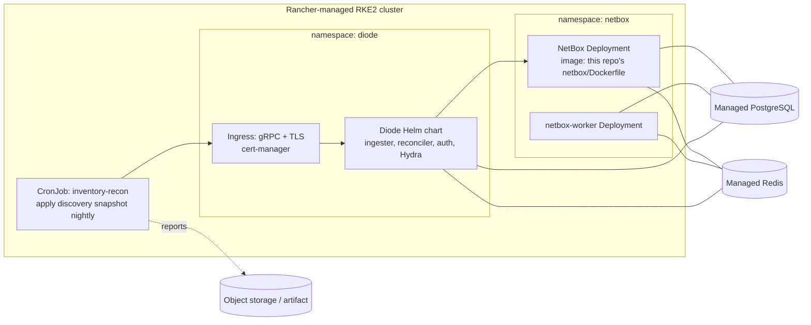

# Container orchestration: Docker Compose → Rancher

**Status:** Docker Compose is the tested deliverable (see `reports/`). This page is the **design**
for moving to Rancher. It has not been run in this MVP; plan time to validate it, see the risks below.

## Recommendation

| Layer | Choice | Why |
|---|---|---|
| Management | **Rancher v2.14.x** (latest patch; v2.15 is the newest minor) | One minor behind latest: modern, but it has had patch releases to settle. Move to 2.15 after its first few patches |
| Kubernetes | **RKE2** (Rancher's hardened distribution), a version listed on the Rancher 2.14 support matrix | CIS-hardened defaults, FIPS option, and lifecycle managed from Rancher |
| Packaging | Helm, installed through Rancher Apps or Fleet (GitOps from this repo) | Same values in every environment; promotion happens through git |
| Data services | Managed PostgreSQL and Redis outside the cluster for production | Leaves backup, HA and upgrades of stateful services to a platform team |

Check the exact RKE2 version against the Rancher support matrix
(https://www.suse.com/suse-rancher/support-matrix/) when you install.

## Mapping

| Compose service | Rancher equivalent |
|---|---|
| `netbox`, `netbox-worker` | `netbox-community/netbox-chart` with `image` set to the image built from `netbox/Dockerfile` (plugin baked in) |
| `diode-*`, `diode-hydra` | Official chart `netboxlabs/diode/charts/diode` |
| `diode-nginx` | The chart's ingress-nginx, or the cluster ingress with gRPC enabled and TLS from cert-manager |
| `secrets/` from `make init` | Kubernetes Secrets, ideally from Vault / External Secrets |
| `make demo` / `recon apply` | `CronJob` running `inventory-recon` with the `RECON_*` env from a Secret; reports pushed to storage |

## Risks found during research

1. **The Diode Helm chart lags the server.** The chart in `netboxlabs/diode` is 1.15.6 with appVersion
   1.5.0, while the tested server is 2.3.1. Pin the image tags to 2.3.1 in the values, and diff the
   chart's env vars against `docker-compose.yaml`. 2.x adds Postgres and auto-apply settings.
2. **gRPC through the ingress** needs HTTP/2 end to end (`nginx.ingress.kubernetes.io/backend-protocol: GRPC`).
3. **Plugin ↔ NetBox compatibility.** Plugin 1.18.0 supports NetBox 4.4.10–4.7.x. Bump both together.

## Validation plan (about 2–3 days)

1. Single-node RKE2 + Rancher in a lab. Install both charts with values that match this compose file.
2. Run the same `recon demo` as a Kubernetes Job. It must produce the same `summary.md` result:
   3/3 PASS, 0 writes on re-run.
3. Kill pods mid-run: the reconciler restarts, rows stuck in `APPLYING` are re-queued, and verification still passes.
